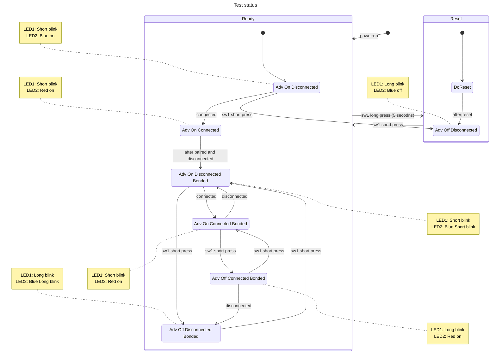

# nRF52840 dongle blood pressure peripheral

## LED Blink Status

* LED1: Green LED
* LED2: Red + Blue + Green LED (RGB LED)
  * White color is created by turning on Red, Blue and Green LEDs at the same time.

Button0 is used to control the device.

* Quick press sw1(button0) to switch between advertising on/off.
* Long press sw1(button0) for 5 seconds to reset the device.
* Double press sw1(button0) to switch between is bonded or not.

|  Status                           |  LED1 Green  |  LED2 Red  |  LED2 Blue  |  LED2 Green  |
|-----------------------------------|--------------| ---------- | ----------- | ------------ |
|  Adv on, disconnected, unbouded   | Short blink  | -          | On          | -            |
|  Adv off, disconnected, unbouded  | Long blink   | -          | Off         | -            |
|  Adv on, Connected, unbouded      | Short blink  | On         | Off         | -            |
|  Adv off, Connected, unbouded     | Long blink   | On         | Off         | -            |
|  Adv on, disconnected, bonded     | Short blink  | -          | Short blink | -            |
|  Adv off, disconnected, bonded    | Long blink   | -          | Long blink  | -            |
|  Adv on, Connected, bonded        | Short blink  | On         | Off         | -            |
|  Adv off, Connected, bonded       | Long blink   | On         | Off         | -            |
|  Reset                            | On 2 sec.    | On 2 sec.  | On 2 sec.   | On 2 sec.    |

Status digital output:

